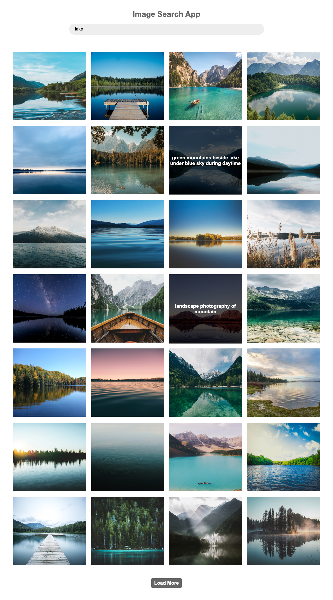

# Image Search Application

This application allows users to search for images using the Unsplash API and display them dynamically on the web page. Users can input search queries and load more images as needed.

## Getting Started

To get started with this application, follow these steps:

1. Clone the repository to your local machine.
2. Ensure you have an access key from Unsplash API. If you don't have one, you can obtain it by signing up at [Unsplash Developer](https://unsplash.com/developers).
3. Replace the placeholder `accessKey` variable in the JavaScript code with your Unsplash API access key.
4. Open the `index.html` file in a web browser to run the application.

## Functionality

### Search Images

Users can enter a search query in the provided input field and press Enter or submit the form to fetch images related to the query.

### Load More Images

Users can click the "Load More" button to fetch additional images related to the last search query. This functionality enables users to load more images without submitting the search form again.

## Code Structure

The JavaScript code utilizes asynchronous functions to fetch images from the Unsplash API and dynamically generate HTML elements to display the images on the web page. Event listeners are added to handle form submission and loading more images.

